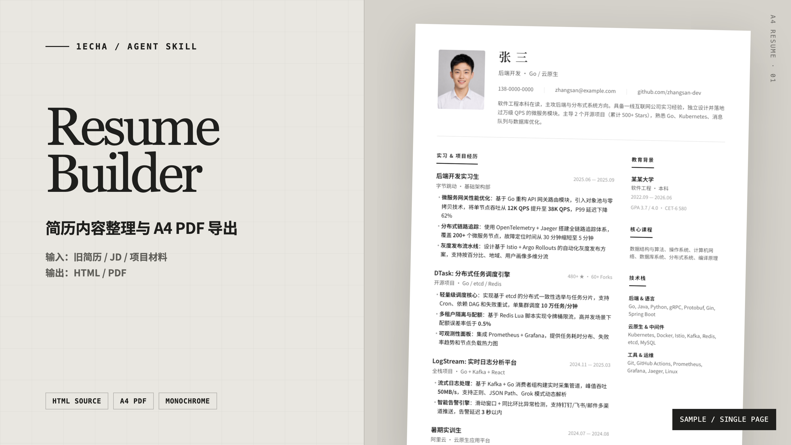

<div align="center">
  <sub>1EchA / AGENT SKILL</sub>
  <h1>Resume Builder</h1>
  <p><strong>用于整理简历内容并导出 A4 PDF 的 Agent Skill。</strong></p>
  <p>输入旧简历、职位描述和项目材料；输出可编辑的 HTML 与 PDF。</p>
  <p>
    <a href="#安装"><strong>安装</strong></a>
    · <a href="examples/single-page.pdf">查看样例 PDF</a>
    · <a href="SKILL.md">阅读 Skill</a>
  </p>
</div>



仓库包含 Skill 指令、HTML/CSS 模板、PDF 导出脚本和一份单页样例。

## 单页样例

样例使用虚构数据，展示经历条目改写、两栏排版和 A4 页面控制。

<p align="center">
  <a href="examples/single-page.pdf">
    
  </a>
</p>

<p align="center"><sub>点击图片查看 PDF · 样例数据均为虚构</sub></p>

## 主要功能

- **材料筛选**：对照目标岗位，从旧简历、成绩单和项目资料中选择相关内容。
- **经历改写**：每条经历尽量写清动作、方法、结果和规模；缺少依据的数据不会补写。
- **版面控制**：支持单页压缩和多页排版，内容溢出时调整栏布局。
- **PDF 导出**：使用 Playwright 输出 A4 PDF，并检查最终页数。

## 安装

```bash
git clone https://github.com/1EchA/resume-builder.git
```

如果需要导出 PDF，再安装渲染依赖：

```bash
pip install playwright pypdf Pillow
python -m playwright install chromium
```

## 使用示例

可以附上现有材料，并说明目标岗位、页数和输出格式：

```text
帮我做一份后端开发简历，目标岗位是字节跳动基础架构。
我有旧简历、成绩单和三个 GitHub 项目，请先帮我筛选内容。
把简历控制在一页，并导出 PDF。
```

单独运行导出脚本：

```bash
python scripts/generate_pdf.py resume.html resume.pdf
```

## 处理步骤

```text
读取目标岗位和现有材料
   ↓
筛选经历与关键词
   ↓
改写经历条目
   ↓
生成 HTML / CSS
   ↓
导出 A4 PDF
   ↓
检查页数并调整布局
```

## 排版规则

- 页面尺寸为 `210mm × 297mm`，屏幕样式和打印样式分开设置。
- 姓名使用 `Noto Serif SC`，正文使用 `Noto Sans SC`。
- 默认采用两栏 Grid；多页内容可切换 Float，使后续页面恢复全宽。
- 黑白配色，重点通过字号、字重、间距和内容顺序区分。

<details>
<summary><strong>样式参数</strong></summary>

| Token | 值 | 用途 |
|---|---|---|
| Primary | `#222` | 正文与核心信息 |
| Secondary | `#666` | 副标题与机构名 |
| Muted | `#999` | 日期与元数据 |
| Border | `#E5E5E5` | 分隔线 |
| Display | `Noto Serif SC` | 姓名 |
| Body | `Noto Sans SC` | 其余内容 |

</details>

<details>
<summary><strong>项目结构</strong></summary>

```text
resume-builder/
├── SKILL.md
├── examples/
│   ├── single-page.pdf
│   └── single-page-preview.png
├── references/
│   ├── template.html
│   └── css-system.md
└── scripts/
    └── generate_pdf.py
```

- [`references/template.html`](references/template.html)：HTML/CSS 模板。
- [`references/css-system.md`](references/css-system.md)：Grid、Float 和打印样式说明。
- [`scripts/generate_pdf.py`](scripts/generate_pdf.py)：将 HTML 导出为 A4 PDF。

</details>

## 兼容方式

适用于能够加载 Markdown Skill 指令的 Agent 环境，包括 Claude Code、Codex 和 Cursor。安装目录由具体环境决定。

## License

MIT
