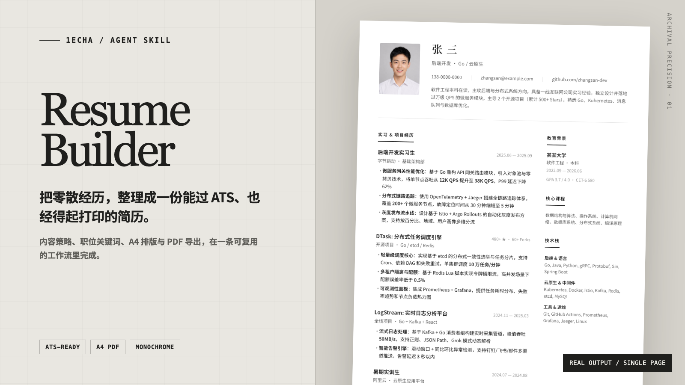
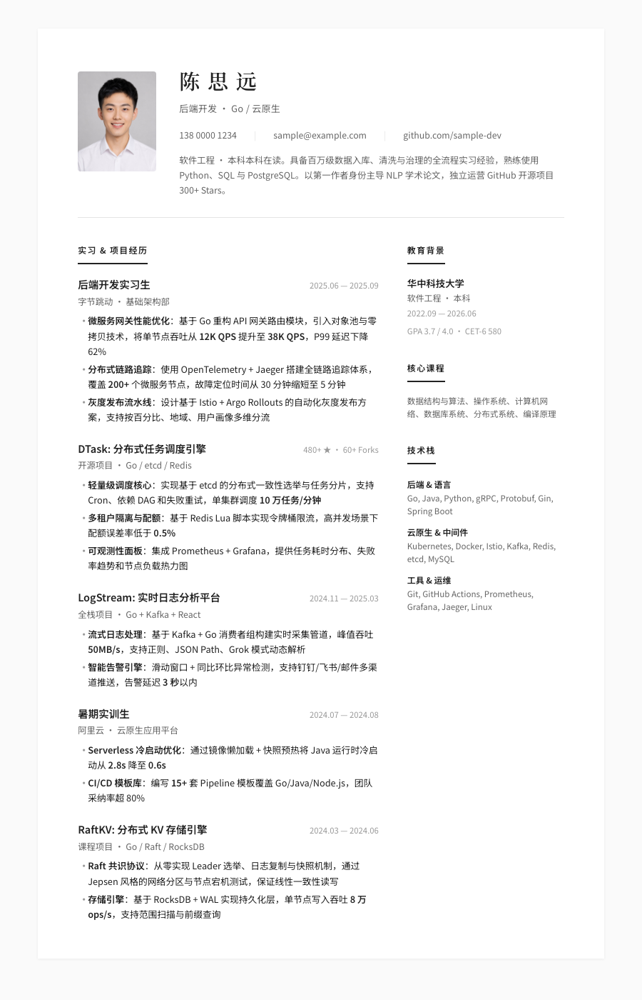

<div align="center">
  <sub>1EchA / AGENT SKILL</sub>
  <h1>Resume Builder</h1>
  <p><strong>把零散经历，整理成一份能过 ATS、也经得起打印的简历。</strong></p>
  <p>内容策略、职位关键词、A4 排版与 PDF 导出，在一条可复用的工作流里完成。</p>
  <p>
    <a href="#30-秒开始"><strong>30 秒开始</strong></a>
    · <a href="examples/single-page.pdf">查看完整 PDF</a>
    · <a href="SKILL.md">阅读 Skill</a>
  </p>
</div>



> **Archival Precision**：单色、精确、克制。不是替你换一个模板，而是重新组织招聘者真正会看的信息。

## 先看结果

这是一份由 Skill 从虚构经历数据生成的单页样例。它同时展示了职位关键词、XYZ+S 经历表述、两栏信息层级和 A4 打印控制。

<p align="center">
  <a href="examples/single-page.pdf">
    
  </a>
</p>

<p align="center"><sub>点击图片查看完整 PDF · 样例数据均为虚构</sub></p>

## 它真正解决什么

| 原始材料 | Skill 做的事 | 最终交付 |
|---|---|---|
| 零散经历、旧简历、JD、项目资料 | 提取关键词，重写经历，筛选相关信息 | 面向目标岗位的内容版本 |
| 项目描述和工作成果 | 用 XYZ+S 结构补齐动作、方法、结果与规模 | 更适合招聘者快速扫描的 bullet |
| 单页或多页内容 | 自动选择 Grid / Float 布局并检查溢出 | HTML 源文件与可打印 A4 PDF |

## 30 秒开始

把仓库克隆到你的 Skill 目录，或让 Agent 直接读取 [`SKILL.md`](SKILL.md)：

```bash
git clone https://github.com/1EchA/resume-builder.git
```

然后直接描述目标，不需要先整理成标准格式：

```text
帮我做一份后端开发简历，目标岗位是字节跳动基础架构。
我有旧简历、成绩单和三个 GitHub 项目，请先帮我筛选内容。
把这份简历压到一页，并导出成 PDF。
```

只有在需要导出 PDF 时，才安装渲染依赖：

```bash
pip install playwright pypdf Pillow
python -m playwright install chromium
python scripts/generate_pdf.py resume.html resume.pdf
```

## 一条完整工作流

```text
目标岗位
   ↓
经历与关键词整理
   ↓
XYZ+S bullet 重写
   ↓
HTML / CSS 排版
   ↓
A4 PDF 渲染
   ↓
页数检测与布局迭代
```

### 内容不是模板填空

- 从 JD 中提取硬技能，并自然写进 Summary 与经历。
- 每段经历保留 2–3 个高信息密度 bullet，按工作逻辑排序。
- 从成绩单、项目和论文中筛选与目标岗位真正相关的内容。
- 重要数字使用受控强调，不靠彩色标签制造重点。

### 排版不是浏览器截图

- 精确的 `210mm` A4 容器与独立打印样式。
- `Noto Serif SC` 只用于姓名，`Noto Sans SC` 负责正文。
- 默认两栏 Grid；内容溢出时切换 Float，让第二页恢复全宽。
- 通过 Playwright 导出，避免浏览器打印产生页眉、页脚和布局偏移。

<details>
<summary><strong>设计系统</strong></summary>

| Token | 值 | 用途 |
|---|---|---|
| Primary | `#222` | 正文与核心信息 |
| Secondary | `#666` | 副标题与机构名 |
| Muted | `#999` | 日期与元数据 |
| Border | `#E5E5E5` | 分隔线 |
| Display | `Noto Serif SC` | 姓名 |
| Body | `Noto Sans SC` | 其余内容 |

纯单色并不是保守：它能稳定打印、减少解析噪音，也避免落入千篇一律的“现代简历”模板。

</details>

<details>
<summary><strong>目录与实现细节</strong></summary>

```text
resume-builder/
├── SKILL.md
├── examples/
│   ├── single-page.pdf
│   └── single-page-preview.png
├── references/
│   ├── template.html
│   └── css-system.md
└── scripts/
    └── generate_pdf.py
```

- [`references/template.html`](references/template.html)：可直接工作的 HTML/CSS 起点。
- [`references/css-system.md`](references/css-system.md)：Grid、Float 与打印样式说明。
- [`scripts/generate_pdf.py`](scripts/generate_pdf.py)：Playwright HTML → A4 PDF。

</details>

## 兼容方式

适用于能够加载 Markdown Skill 指令的 Agent 环境，例如 Claude Code、Codex 与 Cursor。具体安装目录由你的 Agent 环境决定；仓库本身不绑定某个平台 API。

## License

MIT
